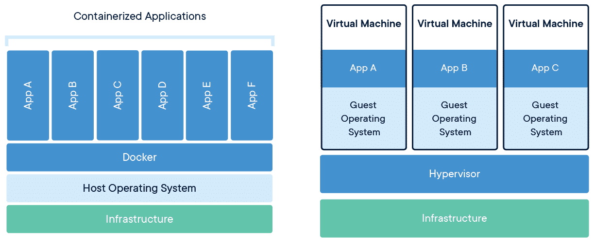

# Terminology

## Monolith architecture
A monolithic architecture is a traditional model of a software program, which is built as a unified unit that is self-contained and independent from other applications. The word “monolith” is often attributed to something large and glacial, which isn't far from the truth of a monolith architecture for software design.

## Microservices architecture
Microservices are an architectural and organizational approach to software development where software is composed of **small independent services** that communicate over well-defined APIs.

## Monolith vs Microservices architecture

Links:

https://www.atlassian.com/microservices/microservices-architecture/microservices-vs-monolith

A monolithic application is built as a ***single unified unit*** while a microservices architecture is a collection of smaller, ***independently deployable services***.

## Container orchestration tool
Container orchestration tools provide a framework for managing containers and microservices architecture at scale.

## K8s
Kubernetes, also known as K8s, is an open source **container orchestration tool** that manages containers, helps manage containerized applications.

Kubernetes includes built-in commands for deploying applications, rolling out changes to your applications, scaling your applications up and down to fit changing needs, monitoring your applications, and more, making it easier to manage applications.

Kubernetes is a distributed system, so it needs a distributed data store like etcd.

## K3s
K3s is a lightweight Kubernetes distribution. It has a very small binary size and very low resource requirements.

**Where does the name come from?**

Kubernetes is a 10-letter word stylized as K8s. So something half as big as Kubernetes would be a 5-letter word stylized as K3s.

## Container
A container is a standard unit of software that packages up code and all its dependencies so the application runs quickly and reliably from one computing environment to another.

## Cluster
A Kubernetes cluster is a set of nodes that run containerized applications.

## Node
Kubernetes runs your workload by placing containers into Pods to run on **Nodes**.

### Master node
A master node is a node which controls and manages a set of worker nodes (workloads runtime) and resembles a cluster in Kubernetes.

### Worker node
Worker nodes within the Kubernetes cluster are used to run containerized applications and handle networking to ensure that traffic between applications across the cluster and from outside of the cluster can be properly facilitated.

## Pod
Pods are the smallest deployable units of computing that you can create and manage in Kubernetes.

## Kubelet
The kubelet is the primary "node agent" that runs on each node. It can register the node with the apiserver using one of: the hostname; a flag to override the hostname; or specific logic for a cloud provider.

## ETCD
ETCD is an open source distributed key-value store used to hold and manage the critical information that distributed systems need to keep running. Most notably, it manages the configuration data, state data, and metadata for Kubernetes, the popular container orchestration platform.

**Where does the name come from?**

The name "etcd" comes from a naming convention within the Linux directory structure: In UNIX, all system configuration files for a single system are contained in a folder called "/etc;" "d" stands for "distributed."

## Docker
Docker is an open source **containerization platform**. It enables developers to package applications into containers - standardized executable components combining application source code with the operating system (OS) libraries and dependencies required to run that code in any environment.

Developers can create containers without Docker, but the platform makes it easier, simpler, and safer to build, deploy and manage containers.

## Types of cloud computing

Links:

https://www.redhat.com/en/topics/cloud-computing/public-cloud-vs-private-cloud-and-hybrid-cloud

### IaaS
Infrastructure as a Service

### PaaS
Platform as a Service

### SaaS
Software as a Service